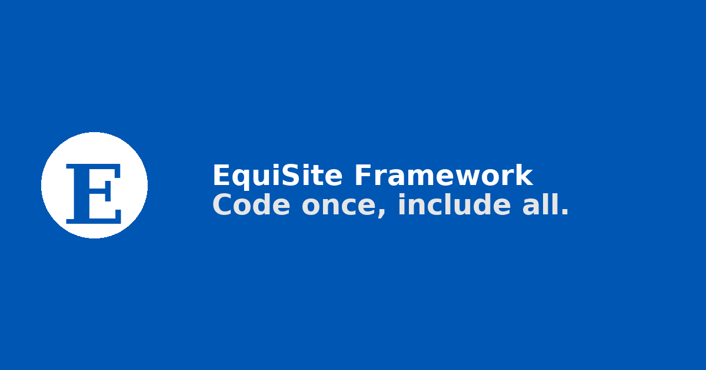

<p align="center">
  
</p>

# EquiSite Framework

**Code once, include all.**

EquiSite is an accessibility-first web framework that helps developers build inclusive, standards-compliant websites without extra overhead.

## Quick start

```bash
npm install
npm run dev
```

Open http://localhost:5173 to view the demo homepage.

## Docs Template

The recommended starting point for docs is `/demo/templates/docs.html` which is wired with theme toggle and font resize utilities.

## License

MIT © 2025 EquiSite Framework
